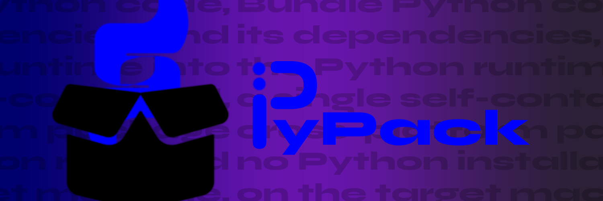

[](https://www.gnu.org/licenses/gpl-3.0)
[](https://www.rust-lang.org/)

> Python kodunu, bağımlılıklarını ve Python runtime'ını tek bir pakete
> dönüştürün — hedef makinede Python kurulu olmasına gerek yok.

**For English documentation → [README.md](README.md)**

---

## İçindekiler

- [Nasıl Çalışır](#-nasıl-çalışır)
- [Özellikler](#-özellikler)
- [Gereksinimler](#-gereksinimler)
- [Kurulum](#-kurulum)
- [Kullanım](#-kullanım)
- [Çıktı Yapısı](#-çıktı-yapısı)
- [Örnek](#-örnek)
- [Bilinen Kısıtlamalar](#️-bilinen-kısıtlamalar)
- [Katkıda Bulunma](#-katkıda-bulunma)
- [Lisans](#-lisans)
- [Teşekkürler](#-teşekkürler)

---

## 🔍 Nasıl Çalışır

1. Python script'inizi **AST tabanlı statik import analizi** ile inceler —
   kodunuz analiz sırasında *asla çalıştırılmaz*; yan etkisi olan kodlar
   (server, dosya işlemleri) için güvenlidir.
2. Harici bağımlılıkları **tespit eder** ve standart kütüphane ile yerel
   modüllerden ayırır.
3. Her hedef platform için bağımsız bir Python runtime'ı
   ([python-build-standalone](https://github.com/indygreg/python-build-standalone))
   **indirir**.
4. Gerekli paketleri (geçişli bağımlılıklarıyla birlikte) her platform için
   `pip download` ile **indirir**.
5. Platforma uygun **başlatıcılar** ve pakete özel bir README **oluşturur**.

```
scriptiniz.py ──► PyPack ──► dist/app_linux-x86_64/
                            dist/app_macos-aarch64/
                            dist/app_windows-x86_64/
```

---

## ✨ Özellikler

- 🔍 **Statik analiz** — AST tabanlı import tespiti; script asla çalıştırılmaz
- 📦 **Tam runtime paketleme** — bağımsız Python yorumlayıcısı dahil eder
- 🌍 **Çapraz derleme** — *tek bir makineden* Linux, macOS ve Windows için üretim
- 🏗️ **Çoklu mimari** — x86_64 ve aarch64 desteği
- 🚀 **Çoklu başlatıcı** — shell script, `.bat`, `.ps1` ve Rust kaynak kodu
- 💾 **Yerel önbellek** — runtime'lar `~/.cache/pypack/` içinde önbelleğe alınır

---

## 📋 Gereksinimler

**Derleme makinesi:**

| Gereksinim | Amaç |
|------------|------|
| [Rust](https://rustup.rs/) (2021 edition+) | pypack'in kendisini derlemek |
| Python 3 + `pip` | Import analizi ve bağımlılık indirme |
| İnternet bağlantısı | İlk seferde runtime ve paket indirmeleri |

**Hedef makine:** hiçbir şey — paket tamamen kendi kendine yeter.

---

## 🔧 Kurulum

**Kaynaktan derleme:**

```bash
git clone https://github.com/EmxrWasHere0/pypack.git
cd pypack
cargo build --release
# Çalıştırılabilir dosya: target/release/pypack
```

**Global kurulum (önerilen):**

```bash
cargo install --path .
# Artık her yerden: pypack <script>
```

---

## 🚀 Kullanım

```bash
# Varsayılan hedefler (linux-x86_64, macos-aarch64, windows-x86_64)
pypack uygulamam.py

# Özel isim ve çıktı dizini
pypack uygulamam.py --name "Uygulamam" -o dist

# Sadece belirli hedefler
pypack uygulamam.py -t linux-x86_64 -t windows-x86_64

# Python sürümünü seç (tam sürüm gerekli)
pypack uygulamam.py -p 3.11.7

# Sadece analiz — indirme ve paketleme yapmaz
pypack uygulamam.py --dry-run

# Desteklenen tüm platformlar
pypack uygulamam.py --all-platforms
```

### Seçenekler

| Seçenek | Açıklama | Varsayılan |
|---------|----------|-----------|
| `<SCRIPT>` | Paketlenecek Python script'i | *(zorunlu)* |
| `-o, --output <DIZIN>` | Çıktı dizini | `dist` |
| `-n, --name <ISIM>` | Uygulama adı | script dosya adı |
| `-t, --targets <LISTE>` | Virgülle ayrılmış hedefler | `linux-x86_64,macos-aarch64,windows-x86_64` |
| `-p, --python-version <SURUM>` | Tam Python sürümü | `3.11.7` |
| `--no-clean` | Önceki çıktıyı koru | kapalı |
| `--dry-run` | Sadece analiz | kapalı |
| `--all-platforms` | Tüm desteklenen hedefler | kapalı |

### Desteklenen hedefler

`linux-x86_64` · `linux-aarch64` · `macos-x86_64` · `macos-aarch64` · `windows-x86_64`

---

## 📂 Çıktı Yapısı
```
dist/
└── myapp_platform-arch/
    ├── myapp              # Unix başlatıcı
    ├── myapp.sh           # Unix başlatıcı (Script Fallback)
    ├── myapp.bat          # Windows başlatıcı (Script Fallback)
    ├── myapp.ps1          # PowerShell başlatıcı (Script Fallback)
    ├── myapp.exe          # Windows başlatıcı
    ├── python/            # Standalone Python runtime
    ├── app/               # Uygulama kodunuz
    │   └── myapp.py
    ├── lib/               # Paketlenmiş gereksinimler
    ├── launcher_src/      # Opsiyonel Rust çalıştırıcı kodu
    │   └── main.rs
    ├── README.md          # Paket başı kullanım notları
    └── pypack.manifest    # Native build'ler için metadata
```

**Paketi çalıştırma:**

```bash
# Linux / macOS
./uygulamam [argümanlar...]

# Windows
uygulamam.bat [argümanlar...]
```

Komut satırı argümanları script'inize iletilir.

---

## 🎯 Örnek

```python
# app.py
import requests

def main():
    r = requests.get("https://api.github.com")
    print(f"Durum: {r.status_code}")

if __name__ == "__main__":
    main()
```

```bash
$ pypack app.py --name github-kontrol

╔════════════════════════════════════════════════════════╗
║  PyPack - Python Code Bundler                          ║
╚════════════════════════════════════════════════════════╝

  Script: app.py
  Uygulama adı: github-kontrol
  Python: 3.11.7
  Hedefler: ["linux-x86_64", "macos-aarch64", "windows-x86_64"]

linux-x86_64 hedefi için paketleniyor...
  [1/5] Python runtime indiriliyor...
  ...
```

PyPack `requests` bağımlılığını tespit eder, her platform için çözümler ve
indirir, runtime'ı paketler ve çalışmaya hazır paketler üretir.

---

## ⚠️ Bilinen Kısıtlamalar

- **Sadece-kaynak paketler** — pypack `pip download --only-binary=:all:`
  kullandığından, hedef platform için önceden derlenmiş wheel'i olmayan
  paketler başarısız olur.
- **Paket boyutu** — tam Python runtime dahildir (paket başına ~50–200 MB).
- **İlk çalıştırma** — runtime'lar ilk kullanımda indirilir; sonraki
  çalıştırmalar önbelleği kullanır.

---

## 🤝 Katkıda Bulunma

1. Depoyu fork'layın
2. Dal oluşturun: `git checkout -b ozellik/harika-ozellik`
3. Commit'leyin: `git commit -m 'Harika özellik eklendi'`
4. Push yapın: `git push origin ozellik/harika-ozellik`
5. Bir Pull Request açın

Hata bildirimleri ve öneriler için [Issues](../../issues) kullanabilirsiniz.

---

## 📄 Lisans

Telif Hakkı (C) 2026 EmxrDev

Bu program özgür yazılımdır: Özgür Yazılım Vakfı tarafından yayımlanan GNU
Genel Kamu Lisansı'nın 3. sürümü ya da (tercihinize göre) daha sonraki bir
sürümü koşulları altında yeniden dağıtabilir ve/veya değiştirebilirsiniz.
Ayrıntılar için [LICENSE](LICENSE) dosyasına bakın.

> **Not:** Lisansın hukuki olarak bağlayıcı metni İngilizce orijinaldir.

---

## 🙏 Teşekkürler

- [python-build-standalone](https://github.com/indygreg/python-build-standalone) — taşınabilir Python runtime'ları için